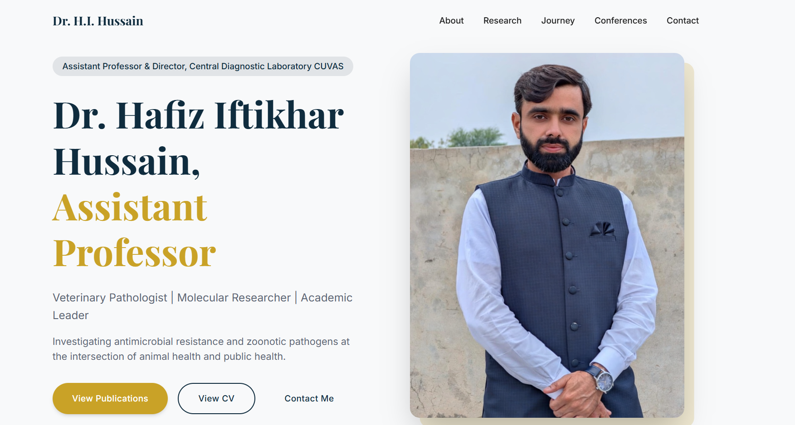

# Dr. Hafiz Iftikhar Hussain - Professional Portfolio

A modern, responsive portfolio website for Dr. Hafiz Iftikhar Hussain, Assistant Professor & Director of Central Diagnostic Laboratory at CUVAS Bahawalpur, Pakistan.



## 👨‍⚕️ About Dr. Hafiz Iftikhar Hussain

- **Position:** Assistant Professor, Department of Pathology
- **Role:** Director, Central Diagnostic Laboratory, CUVAS Bahawalpur
- **Education:** PhD in Basic Veterinary Medicine (Pathobiology), Huazhong Agricultural University, Wuhan, China (2017)
- **Expertise:**
  - Veterinary Pathology
  - Antimicrobial Resistance (AMR) Research
  - Molecular Diagnostics
  - One Health & Zoonotic Diseases
  - Whole Genome Sequencing & Transcriptomics

### Key Publications Areas
- Antimicrobial resistance in poultry pathogens
- ESBL-producing bacteria surveillance
- Molecular pathogenesis of MDR E. coli
- Zoonotic disease transmission

## 🛠️ Project Overview

This portfolio showcases Dr. Hussain's academic achievements, research publications, professional journey, and provides a contact form for collaboration inquiries.

### Features

- **Responsive Design** - Works on all devices (mobile, tablet, desktop)
- **Hero Section** - Professional introduction with photo and credentials
- **Statistics Section** - Publications, years of experience, roles
- **About Section** - Detailed background and research focus areas
- **Research Section** - Published papers and thesis work
- **Timeline Section** - Academic and professional journey
- **Conferences Section** - Attended conferences and workshops
- **Contact Section** - Working contact form with EmailJS integration
- **SEO Optimized** - Meta tags, structured data for search engines

## 🏗️ Tech Stack

- **Frontend:** React 19
- **Styling:** Tailwind CSS
- **Animations:** Framer Motion
- **Icons:** Lucide React
- **Email Service:** EmailJS
- **Build Tool:** Vite
- **Deployment:** Netlify

## 📁 Project Structure

```
hussain-portfolio/
├── public/
│   └── favicon.svg
├── src/
│   ├── assets/
│   │   └── hafiz-portfolio.jpeg
│   ├── components/
│   │   ├── layout/
│   │   │   ├── Footer.jsx
│   │   │   └── Navbar.jsx
│   │   ├── sections/
│   │   │   ├── AboutSection.jsx
│   │   │   ├── ConferencesSection.jsx
│   │   │   ├── ContactSection.jsx
│   │   │   ├── HeroSection.jsx
│   │   │   ├── ResearchSection.jsx
│   │   │   ├── StatsSection.jsx
│   │   │   └── TimelineSection.jsx
│   │   └── ui/
│   │       ├── Badge.jsx
│   │       ├── Button.jsx
│   │       ├── Card.jsx
│   │       ├── Container.jsx
│   │       └── SectionTitle.jsx
│   ├── data/
│   │   └── portfolioData.js
│   ├── hooks/
│   │   └── useScrollAnimation.js
│   ├── App.css
│   ├── App.jsx
│   ├── index.css
│   └── main.jsx
├── index.html
├── package.json
├── vite.config.js
└── eslint.config.js
```

## 🚀 Getting Started

### Prerequisites

- Node.js (v18 or higher)
- npm or yarn

### Installation

1. **Clone the repository**
   ```bash
   git clone https://github.com/your-username/dr-hafiz-hussain-portfolio.git
   cd dr-hafiz-hussain-portfolio
   ```

2. **Install dependencies**
   ```bash
   npm install
   ```

3. **Start development server**
   ```bash
   npm run dev
   ```

4. **Build for production**
   ```bash
   npm run build
   ```

5. **Preview production build**
   ```bash
   npm run preview
   ```

### Environment Variables

The contact form uses EmailJS. To configure:

1. Create an account at [EmailJS](https://www.emailjs.com/)
2. Add an email service (Gmail, Outlook, etc.)
3. Create an email template with these variables:
   - `{{name}}` - Sender's name
   - `{{email}}` - Sender's email
   - `{{subject}}` - Subject line
   - `{{message}}` - Message body
4. Update credentials in `src/components/sections/ContactSection.jsx`:
   ```javascript
   const EMAILJS_SERVICE_ID = 'your_service_id';
   const EMAILJS_TEMPLATE_ID = 'your_template_id';
   const EMAILJS_PUBLIC_KEY = 'your_public_key';
   ```

## 🎨 Customization

### Updating Personal Information

Edit `src/data/portfolioData.js` to update:
- Contact information
- About text
- Research areas
- Publications
- Timeline events
- Conferences

### Changing Colors

Edit Tailwind configuration or `src/index.css` to customize:
- Primary color
- Accent color
- Background colors

### SEO Configuration

Update `index.html` with:
- Your actual deployed URL
- OG image for social sharing

## 📄 License

This project is created for educational/personal use.

## 📧 Contact

- **Email:** hafiziftikharhussain@cuvas.edu.pk
- **LinkedIn:** [/in/hafiz-iftikhar-hussain](https://linkedin.com/in/hafiz-iftikhar-hussain)
- **Institution:** CUVAS, Bahawalpur, Pakistan

---

*Built with ❤️ using React + Tailwind CSS*